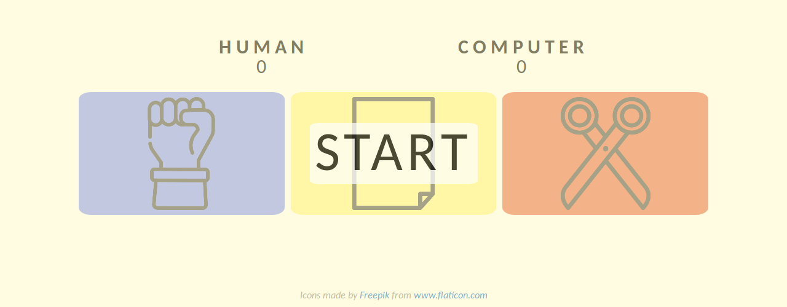

# [Rock Paper Scissors](https://clavierbulb-green.github.io/A-New-Rock-Paper-Scissors/)
---

A simple 5-round game of **Rock Paper Scissors** playable in the browser.

---
## How To Play

Select your move by pressing one of the three move buttons on the screen.
Click anywhere on the screen to hide the result message that appears at the end
of each round.
A winner is announced at the end of 5 rounds, after which simply click on the 
screen again to start a new game. 

---
## References

+ <https://www.theodinproject.com/courses/web-development-101/lessons/rock-paper-scissors>
